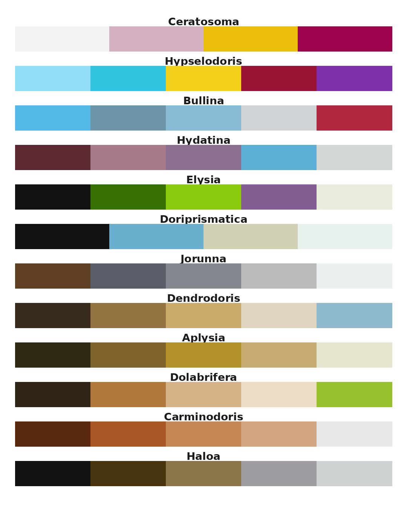

# nudibranch

Colour palettes inspired by intertidal and shallow rocky reef nudibranchs and sea slugs 
photographed in NSW, Australia.

## Installation
install.packages("devtools")
devtools::install_github("nikihubbard-source/nudibranch")

## Usage
library(nudibranch)

# See all palettes
nudibranch_palette()

# Get a palette
nudibranch_palette("hypselodoris")

# Use with ggplot2
ggplot(data, aes(x, y, colour = group)) +
  scale_colour_nudibranch("hypselodoris")

ggplot(data, aes(x, y, fill = group)) +
scale_fill_nudibranch("hydatina")

# or specify palette, number, and order - for example:

scale_fill_manual(values = nudibranch_palette("elysia", n=4)[c(3, 4, 1)])+

## Palettes

## Palettes

📷 [View full palette gallery]((https://bsky.app/profile/did:plc:xzg5yai3lgaueuqw7yxydf5r/post/3micmgldaqs2l))
